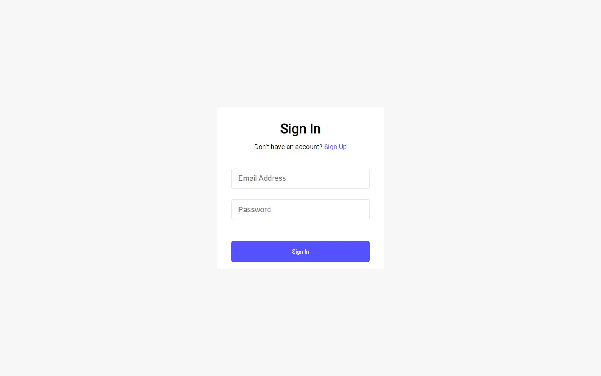

# Php Registration/Login form
#### Registration and login with email verification
---

## How it works?
---
First, the user needs to register in the registration form, then verify the email address using the code that was sent to their email address, and finally log in using this data.

## Usage
---
- Set up your XAMPP server to send emails
- Create database (e.g) registration, and import messages.sql file there (./src/users.sql)

## Built with

---

- Semantic HTML5 markup
- CSS custom properties
- PHP

## Author

---
- [Artur Harutyunyan](https://github.com/ArturHarutyunyan1)